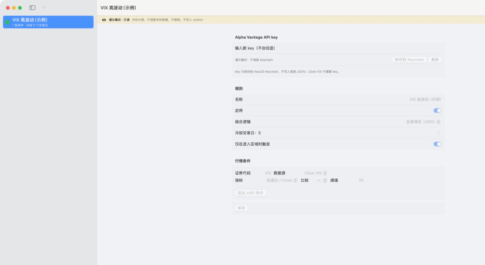

# iMarketMessage（iMM）

> 当前开发版本正在准备 `v0.2.0-beta`：增加本地 `.app` 构建、macOS 通知和由 Service Management 管理的后台监控。当前公开稳定标签仍是 [`v0.1.0-alpha`](https://github.com/neverasecond/iMarketMessage/releases/tag/v0.1.0-alpha)；beta 尚未发布，也没有可下载的公证二进制。

iMarketMessage（面向用户的 macOS 应用名：iMM）是一个面向 macOS 14+ 的原生 Swift/SwiftUI 开源 MVP：按自定义证券代码、数据源、指标和阈值评估行情条件，在满足规则时将短消息写入本机安全出站队列，供用户另行授权的 iMessage gateway 发送。当前源码 alpha 版本线为 `v0.1.0-alpha`。

Swift Package 同时保留 `MarketMessage` 兼容识别名；面向用户的可执行目标优先使用 `iMM`，这不代表另一个服务或账号。最终可分发 `.app` 的包装、签名和公证按发布者的实际方案确认，见 [开发者指南](DEVELOPMENT.md)、[限制说明](LIMITATIONS.md) 和 [发布清单](RELEASE_CHECKLIST.md)。

主 App 不读取 Messages 数据库、Contacts、电话号码或 chat ID，不自动安装或启用 LaunchAgent，也不会调用 GitHub/`gh`、Codex/OpenAI。默认不会自动发送消息；用户完成 paired-self 首次配对并明确点击“发送一次”后，App 可以通过 `/usr/bin/osascript` 把 outbox 提交给 Messages。打包内的 gateway companion 也只有在用户明确启用并批准 `SMAppService`、已有 paired-self 后才会自动消费 outbox。gateway、消息路由和 Apple Events 权限仍由用户单独审查并授权。

以下截图是 iMM 的只读演示界面，不读取真实行情、不写入 outbox：



## 快速开始

要求：macOS 14+、完整 Xcode（含 Swift 6 和 Swift Testing 运行时）。仅有精简 CommandLineTools 可能缺少 `lib_TestingInterop.dylib`；请先阅读 [DEVELOPMENT.md](DEVELOPMENT.md)。

```sh
git clone https://github.com/neverasecond/iMarketMessage.git
cd iMarketMessage
swift build --scratch-path /tmp/imarketmessage-build
swift test --scratch-path /tmp/imarketmessage-test
swift run --scratch-path /tmp/imarketmessage-cli market-message-cli --config Config/example-rules.json --outbox /tmp/imarketmessage-outbox --state /tmp/imarketmessage-state.json
# The SwiftUI app stays open until you press Ctrl-C.
swift run --scratch-path /tmp/imarketmessage-app iMM
```

CLI 会输出结构化 JSON 健康状态。默认使用 Application Support 下的 `rules.json`、`Outbox/` 和 `runtime-state.json`；`--config`、`--outbox`、`--state` 可覆盖。上面的 CLI 示例会访问 Cboe VIX 日线；测试完全不联网。临时 scratch 目录不属于仓库，完成后可删除。

测试使用 Swift Testing；完整 Xcode toolchain 会提供测试运行时。精简 CommandLineTools 若报告缺少 `lib_TestingInterop.dylib`，请在完整 Xcode 下运行，不要把系统运行时库加入仓库。

### 构建、校验与安装本机 App（v0.2.0-beta 开发中）

完整 Xcode 已被选中时，可在自己的 Mac 上生成 ad-hoc 签名的 App 和 ZIP：

```sh
scripts/build-local-app.sh
open dist/iMM.app
```

脚本在 `dist/` 生成三个交付物：`iMM.app`、`iMM-v0.2.0-beta-local.zip` 和同名 `.zip.sha256` 校验文件。校验文件只对应 ZIP；下载或复制 ZIP 后可运行：

```sh
(cd dist && shasum -a 256 -c iMM-v0.2.0-beta-local.zip.sha256)
```

输出是从源码构建的 ad-hoc 签名本机测试包，不是 Developer ID 签名、Apple 公证或可绕过 Gatekeeper 的公开二进制。构建脚本优先嵌入经过 `iconutil` 验证的 `Packaging/AppIcon.icns`；若该正式资源不存在，则明确回退到 `Packaging/AppIcon-1024.png` 开发资源，不能把 PNG 回退写成已完成的发布图标。

默认安装到 `~/Applications/iMM.app`，会先校验 bundle/plist/签名、按 gateway→monitor 顺序停止当前用户中明确的 `com.imarketmessage.gateway`/`com.imarketmessage.monitor`（若已加载），再以 staging + 替换方式安装；不会自动注册后台服务：

```sh
scripts/install-local-app.sh --app dist/iMM.app
# 要安装到系统 Applications，显式指定目标并按提示确认：
scripts/install-local-app.sh --app dist/iMM.app --destination /Applications
```

安装/升级不会删除 `~/Library/Application Support/MarketMessage`。完整升级、回滚、卸载和后台服务清理步骤见 [v0.2 升级与卸载说明](docs/V0.2_UPGRADE.md)。卸载脚本默认保留用户数据；只有明确加 `--remove-data` 并确认才会删除该精确目录，Keychain 中的 API key 仍需在 App 或“钥匙串访问”中单独删除：

```sh
scripts/uninstall-local-app.sh --app "$HOME/Applications/iMM.app"
```

首次启用本地通知时由用户主动点击“请求权限”；后台监控和 iMessage gateway companion 分别由 App 内按钮通过 macOS `SMAppService` 注册或停用，系统可能要求在“系统设置 → 通用 → 登录项”中批准。两个服务的状态、停用顺序和升级/卸载回滚见 [升级与卸载说明](docs/V0.2_UPGRADE.md)。当前仓库和 CI 尚未替代真实 Mac 验证，见 [发布清单](RELEASE_CHECKLIST.md)。

UI 可以浏览、添加、编辑、删除、启用/禁用规则，并选择 provider、指标、比较符、阈值、冷却交易日和“仅首次进入区域”。规则保存到 `~/Library/Application Support/MarketMessage/rules.json`，写入采用原子替换和 `0600` 权限。

## 规则与数据源

- 条件支持 `close` 和 `dailyPercentChange`，比较符 `>=`、`<=`、`>`、`<`。
- 一个规则的条件以 AND 组合；支持冷却交易日、进入区域才触发、启用/禁用。
- `Cboe VIX（日线）`无需 API key，读取 Cboe 公布的 VIX 历史 CSV；请求有超时、HTTP 状态检查、America/New_York 日期解析和过期拒绝。
- `Alpha Vantage（日线）`为 BYO API key 适配器。key 通过抽象的 `APIKeyStore` 取得；macOS 使用 Keychain 实现（`KeychainAPIKeyStore`），测试使用内存替身。key 不会写入规则 JSON、日志或仓库。
- Yahoo/yfinance 仅作为可选 Community provider 方向，不是商业默认，也没有打包非官方抓取代码。使用任何公开 API 前，请自行确认服务条款、许可和速率限制。

市场数据可能延迟、缺失或修订；“过期”判断只是安全闸门，不是交易所日历。市场数据许可和税务/合规责任由使用者承担。iMM 不是投资建议。完整的首版限制见 [LIMITATIONS.md](LIMITATIONS.md)。

## iMessage gateway 边界

`GatewayOutboxSink` 向用户指定的本地目录写入一个 JSON 文件（原子写、文件 `0600`、目录 `0700`）。文件 ID 由规则 UUID 和交易日期确定，同一事件重复运行会覆盖同一文件而不会产生一组随机文件：

```json
{"id":"...","source":"market-message","text":"..."}
```

只允许 `source`、`id`、`text` 三个字段，消息正文默认限制 4,000 UTF-8 字节。真实发送由 App 的“发送一次”和仓库内的 paired-self gateway companion 提供；两者都只从本机 pairing 文件重新读取唯一目标，不接受 recipient 参数，不读取 Messages 数据库或 Contacts。队列消费者协议和 paired-self 限制见 [docs/GATEWAY_PROTOCOL.md](docs/GATEWAY_PROTOCOL.md)。

当前仓库提供 `--dry-run` 只读预览和显式 `--send` 发送路径。准备好权限为 `0700` 的已有 outbox 目录和首次配对生成的 `paired-self.json` 后，可先运行：

```sh
swift run --scratch-path /tmp/imarketmessage-gateway iMM-gateway \
  --dry-run \
  --outbox /tmp/imarketmessage-outbox \
  --pairing /tmp/imarketmessage-paired-self.json \
  --ack /tmp/imarketmessage-gateway-acks.json
```

`--dry-run` 只读取并校验现有文件，绝不发送、创建目录、改权限、写 ACK、移动或删除 outbox 文件；不带 `--dry-run` 或 `--send` 会直接拒绝运行。发送不会由构建脚本或安装脚本自动触发；App UI 的“发送一次”和 CLI `--send` 都要求用户明确操作。

发送必须由用户另行确认，并会调用 `/usr/bin/osascript` 访问 Messages。正确的 paired-self 目标在实机上可以送达；但 `osascript` 进程返回 0 只表示 Messages 接受了 AppleScript 请求，不是运营商或设备的送达回执。错误或失效的目标可能让进程仍返回 0，而 Messages 随后无法送达；发送后必须检查 Messages/目标设备：

```sh
swift run --scratch-path /tmp/imarketmessage-gateway iMM-gateway \
  --send \
  --outbox /tmp/imarketmessage-outbox \
  --pairing /tmp/imarketmessage-paired-self.json \
  --ack /tmp/imarketmessage-gateway-acks.json
```

`--send` 是 CLI 唯一允许消费/发送的开关；它不接受 `--recipient`、电话号码、chat ID 或其他目标参数。打包 companion 的 LaunchAgent plist 只传 `--send`，CLI 在未传路径时使用当前用户 Application Support 的默认 `Outbox/`、paired-self 和 ACK 路径。App UI 的“启用 iMessage companion”同样只在配对存在时通过 `SMAppService` 注册；安装脚本不会自动注册该服务。首次发送可能触发 Apple Events/自动化权限提示，拒绝时必须在系统设置中明确处理。

## 后台运行

打包 App 内含 `com.imarketmessage.monitor.plist`（本地行情检查）和 `com.imarketmessage.gateway.plist`（显式 `--send` 的 paired-self companion）。它们是两个独立的 `SMAppService` 项：先在 App 内停用 gateway companion，再停用 monitor；确认两个状态都为“未注册”后再升级或卸载。恢复时先打开新 App、确认 pairing 和数据仍在，再按需要启用 monitor，最后启用 gateway companion 并在系统设置中批准。构建、安装脚本和 CI 都不会自动注册服务；脚本只对当前用户精确 label 做残留 `launchctl bootout`。`Config/com.marketmessage.monitor.plist.example` 是独立的旧式模板，含占位路径，不能与内嵌服务混用。完整步骤见 [升级与卸载说明](docs/V0.2_UPGRADE.md)。

## 隐私与安全

没有遥测、广告、联系人同步或云端账户。规则和运行状态只写入本机 Application Support；API key 仅进入 Keychain 接口。详见 [PRIVACY.md](PRIVACY.md)、[SECURITY.md](SECURITY.md) 和 [DEVELOPMENT.md](DEVELOPMENT.md)。macOS 的网络、Keychain、文件和自动化权限可能带来风险，请按最小权限审查。

## English summary

iMarketMessage (iMM) is a native macOS 14+ SwiftUI/Swift Package Manager MVP for user-defined market rules. The current source alpha line is `v0.1.0-alpha`; it supports Cboe VIX daily data, an Alpha Vantage BYO-key adapter, AND conditions, entry-only alerts, trading-day cooldowns, atomic `0600` rule storage, and a local JSON outbox for an independently authorized iMessage gateway. It has no telemetry, does not read Messages, and never stores phone numbers, chat IDs, API keys in JSON, or investment advice.

## 开源许可

源代码按 [MPL-2.0](LICENSE) 发布；第三方和数据源说明见 [NOTICE](NOTICE)。
